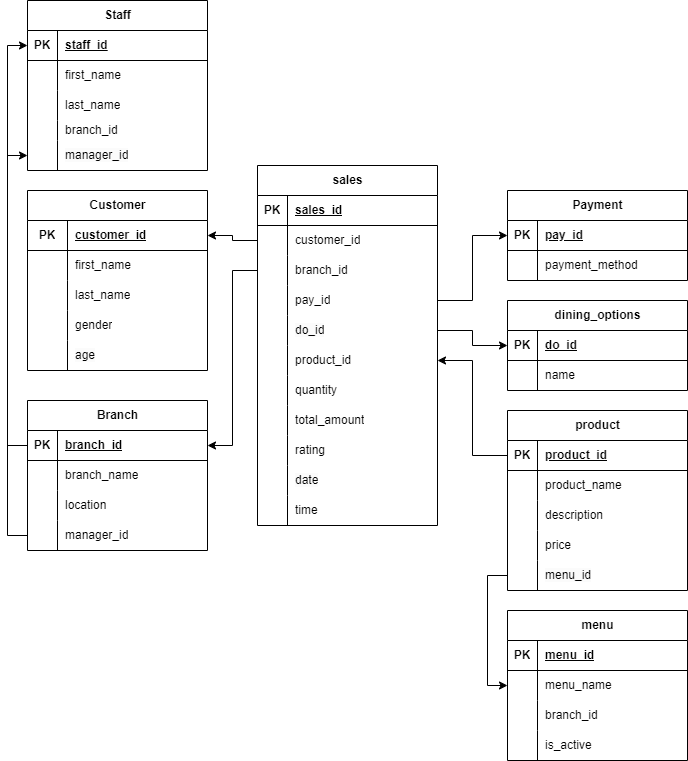

# Fufu Republic Dimensional Model Assignment

This repository contains my work for the Fufu Republic case study, a restaurant chain operating across multiple branches in Nigeria. The objective of the assignment is to design a data model and develop a dimensional model for data-driven decision-making, focusing on sales trends and customer behavior.

## Task 1: Entity-Relationship Diagram (ERD)

In Task 1, I created an Entity-Relationship Diagram (ERD) to map out the necessary entities, relationships, and constraints for Fufu Republic. The model captures essential aspects of the restaurant's operations, including:

- **Branches**: Different locations of Fufu Republic, each with its unique menu and staff.
- **Products**: Menu items offered at each branch, varying across locations.
- **Sales**: Detailed records of transactions including the product purchased, customer, branch, payment method, and dining option.
- **Staff**: Employees working at different branches, linked to their respective branches.
- **Customer**: Information about the customers who place orders.
- **Payments**: Payment methods used for transactions.
- **Dining Options**: Different ways customers can place orders (e.g., dine-in, take-out).
- **Menu**: Contains different menu per location including whether the menu is active or not.

#### Link to Model Diagram

### ERD Structure:
- Entities such as `Branch`, `Customer`, `Product`, `Staff`, `Menu`, and `Sales` have been defined with primary and foreign keys to establish relationships.
- The relationships between entities (e.g., a branch having many sales, a customer making many purchases) were modeled using one-to-many relationships.

## Task 2: Dimensional Model (In Progress)

For Task 2, I have started building a dimensional model based on the **Customer Order** business process. The goal of this model is to analyze which products are ordered the most and from which locations.

### Business Process
**Customer Order**: This process captures customer transactions, detailing the products they order and the locations they order from.

### Business Question
- **What product do our customers order the most, and from which locations?**

### Dimensional Model

#### Grain
The grain of the fact table is at the individual sales transaction level, recording each product purchased by customers from specific branches.

#### Dimensions and Facts

| Entity Type | Entity   | Attributes                                |
|-------------|----------|-------------------------------------------|
| Dimension   | Product  | `product_name`                            |
| Dimension   | Location | `branch_name`, `location`                 |
| Fact        | Sales    | `customer_id`, `date`, `quantity`, `total_amount`, `product_id` |

- **Dimensions**: The product and location entities provide descriptive information about the product being sold and the branch where the transaction occurs.
- **Fact Table**: The sales table captures the quantitative data needed for analysis, such as quantity sold, total amount, and the relationship with the product and location dimensions.

## Next Steps
Finish constructing the dimensional model by integrating all dimensions and facts into a complete structure. Further analysis will involve answering the business question posed above and potentially expanding on additional business processes.

## Conclusion

In this assignment, I have designed a comprehensive ERD for Fufu Republic that highlights the key entities, relationships, and operations within the business. Task 1 and 2 has been completed. The next item would involve building a dimensional model to address customer order patterns across the restaurant's branches.

---
